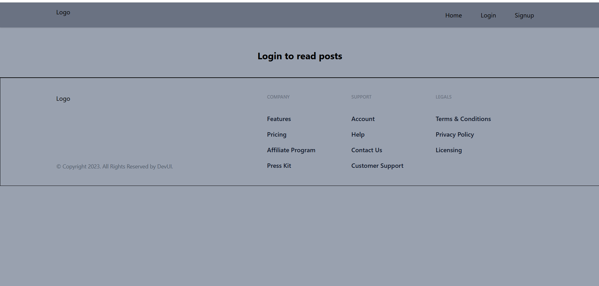
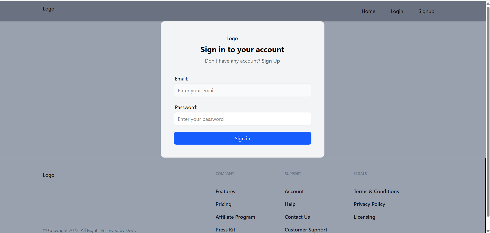
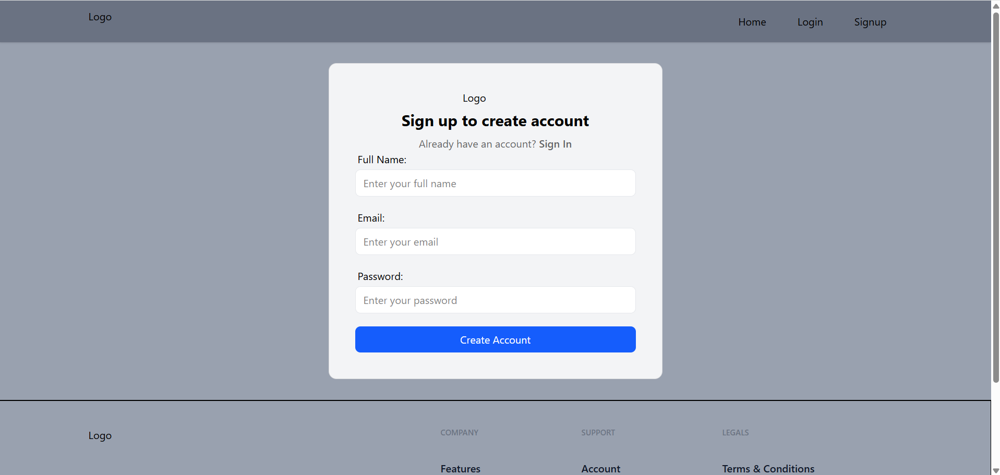
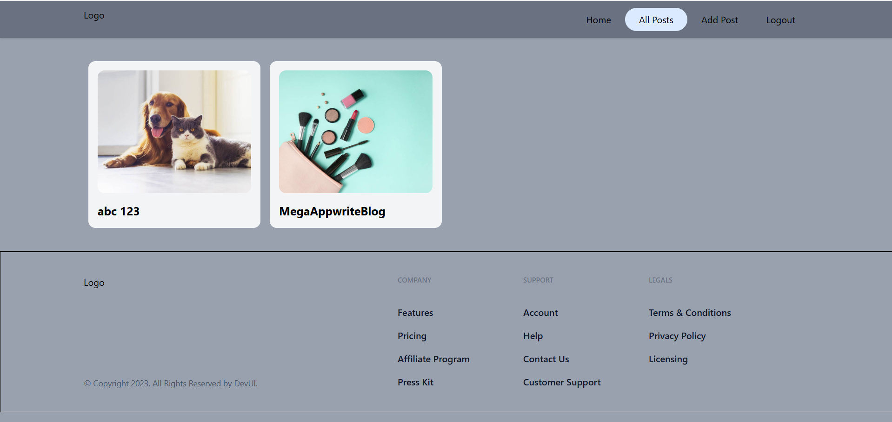
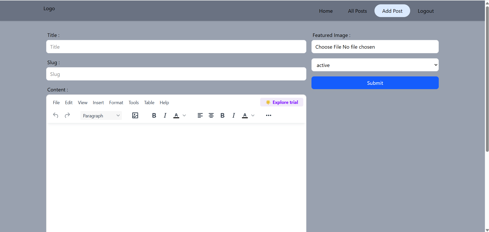
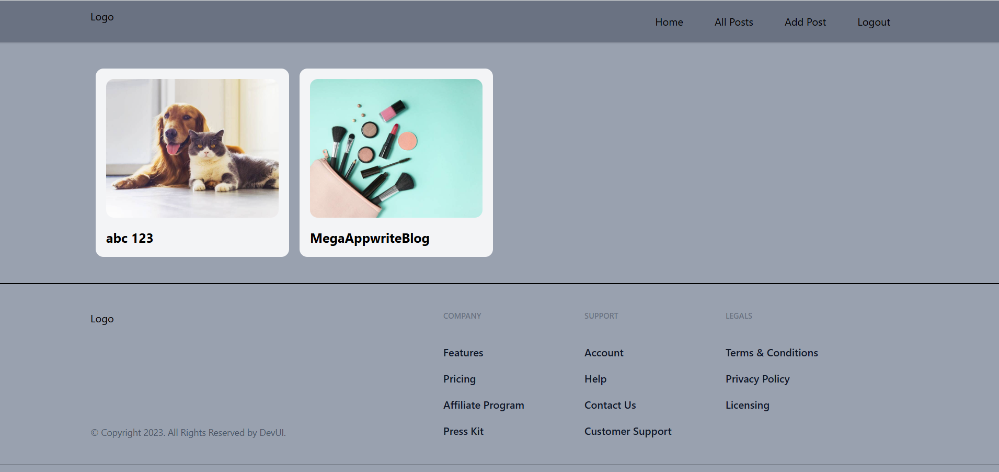

# 📝 Mega Blog App

<p align="center">
  <strong>A modern full-stack blogging platform built with React, Appwrite, Redux Toolkit, Tailwind CSS, and TinyMCE.</strong>
</p>

<p align="center">
  <a href="https://mega-appwrite-blog.vercel.app"><strong>🌐 Live Demo</strong></a>
</p>

---

## 📖 Overview

Mega Blog App is a full-stack blogging platform that enables users to securely authenticate, create, edit, and manage blog posts through a clean and responsive interface. The application integrates Appwrite for authentication, database, and storage services, while TinyMCE provides a rich text editing experience for creating engaging blog content.

This project demonstrates modern React development practices, including state management, routing, form handling, cloud backend integration, and deployment.

---

## ✨ Features

* 🔐 Secure User Authentication (Sign Up, Login & Logout)
* 📝 Create, Edit, and Delete Blog Posts
* 📄 Rich Text Editor using TinyMCE
* 🖼️ Featured Image Upload
* 📚 View Published Blog Posts
* 🔒 Protected Routes
* ⚡ Responsive User Interface
* ☁️ Cloud Backend with Appwrite

---

## 🛠 Tech Stack

| Category             | Technologies                                 |
| -------------------- | -------------------------------------------- |
| **Frontend**         | React, Vite, JavaScript (ES6+), Tailwind CSS |
| **State Management** | Redux Toolkit                                |
| **Routing**          | React Router DOM                             |
| **Forms**            | React Hook Form                              |
| **Rich Text Editor** | TinyMCE                                      |
| **Backend**          | Appwrite                                     |
| **Database**         | Appwrite Database                            |
| **Storage**          | Appwrite Storage                             |
| **Deployment**       | Vercel                                       |

---

## 📂 Project Structure

```text
MegaAppwriteBlog
│
├── screenshots/
├── src/
│   ├── appwrite/
│   ├── components/
│   ├── conf/
│   ├── pages/
│   ├── store/
│   ├── App.jsx
│   └── main.jsx
│
├── public/
├── .env.sample
├── .gitignore
├── package.json
├── vite.config.js
└── README.md
```

---

## 🚀 Getting Started

### Clone the repository

```bash
git clone https://github.com/priyankayadav131017/MegaAppwriteBlog.git
```

### Navigate to the project

```bash
cd MegaAppwriteBlog
```

### Install dependencies

```bash
npm install
```

### Configure Environment Variables

Create a `.env` file by copying the sample environment file:

```bash
cp .env.sample .env
```

Update the environment variables with your own Appwrite and TinyMCE credentials.

### Start the development server

```bash
npm run dev
```

### Build for production

```bash
npm run build
```

---

## 📸 Screenshots

### 🏠 Home Page



---

### 🔑 Login



---

### 📝 Sign Up



---

### 📚 All Posts



---

### ➕ Add Post



---

### 📄 Post Details



---

## 👩‍💻 Author

**Priyanka Yadav**

* GitHub: https://github.com/priyankayadav131017

---

## 🌐 Live Demo

**https://mega-appwrite-blog.vercel.app**
